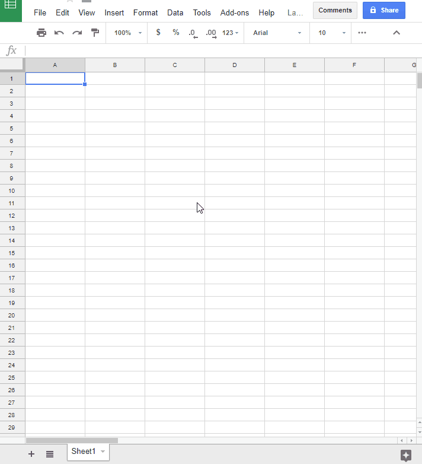

RearrangeScripts
=====

# Overview
This is a GAS application for rearranging Google Apps Scripts (GAS) in a project which can be seen at the script editor.

# Demo

# Description
Have you ever thought about rearranging Google Apps Scripts in a project which can be seen at the script editor? I also have thought about it. Finally, I could find the workaround to do it. And recently, I have given this function to [ggsrun](https://github.com/tanaikech/ggsrun/blob/master/help/README.md#rearrangescripts) which is a CLI tool. Furthermore, I thought that if there is a GUI application for rearranging scripts in a project, it may be useful for more users. So I created this. Today, I published this as a GUI tool using Google Apps Script. If this was useful for you, I'm glad.

# Library's project key
~~~
1OHZqwmyQ3v2aeiCMJbmhfe_7OY1TZYAhIzOZhhLqrMd7wzLufD2CJbQX
~~~

# How to install
1. Create new spreadsheet or document.
    - This application has to be used for bound script of spreadsheet and/or document because of use the side bar.
1. Open script editor and [Install RearrangeScripts library](https://developers.google.com/apps-script/guides/libraries).
    - Library's project key is **``1OHZqwmyQ3v2aeiCMJbmhfe_7OY1TZYAhIzOZhhLqrMd7wzLufD2CJbQX``**.
1. [Enable Drive API at API console](https://console.developers.google.com/apis/api/drive/overview)
    - On script editor
    - Resources -> Cloud Platform project
    - View API console
    - At Getting started, click Enable APIs and get credentials like keys.
    - At left side, click Library.
    - At Search for APIs & services, input **Drive API**. And click Google Drive API.
    - Click Enable button.
        - If it has already been enabled, please don't turn off.

<u>Installing is done! You can use RearrangeScripts.</u>

[In the case of an error related to scopes, please check here.](#QA)

# Usage
Please copy and paste the following script to the script editor installed this application, and run ``doRearrangement``. By this, the sidebar is opened on Spreadsheet.

~~~javascript
function doRearrangement(e) {
    return RearrangeScripts.doRearrangement(e);
}
~~~

### Note :
- Please don't change the function name.
- When you carried out the first run of this script, if the files are not shown in the side bar, please reopen the spreadsheet or document.
- If you want to open above script when you open Spreadsheet or Document, please use as following sample.

~~~javascript
function onOpen() {
    doRearrangement();
}

function doRearrangement(e) {
    return RearrangeScripts.doRearrangement(e);
}
~~~

### IMPORTANT!
> 1. For rearranging scripts, there is one important point. <u>**When scripts in a project is rearranged, version history of scripts is reset once. So if you don't want to reset the version history, before rearranging, please copy the project.**</u> By copying project, the project before rearranging is saved.
> 2. The rearrangement of scripts can be done for only standalone scripts. Because although the bound scripts can retrieve scripts, it cannot be updated.

# Principle of rearranging
1. Download all scripts in a project.
1. Overwrite the project by one script with the filename which is difference from the filenames of downloaded scripts.
1. Rearrange the downloaded scripts.
1. Overwrite the project by the rearranged scripts. At this time, remove the script ID of each script.

When existing project is overwritten by a script with an unique filename, all scripts in the project are removed and only the file with the unique name is remained. I thought that this can be applied for rearranging scripts.

For operating project, you can use [ProjectApp](https://github.com/tanaikech/ProjectApp). This application also uses ProjectApp.

-----

# Q & A
- [Set scopes at Manifests](https://developers.google.com/apps-script/concepts/manifests)
    - On script editor
        - View -> Show manifest file
        - Add **"oauthScopes"** to "appsscript.json". After you installed the library and added the scopes to the default "appsscript.json", it becomes as follows. This timeZone is my current time zone. <u>Of course, you can install the library by directly modifying "appsscript.json".</u>

~~~json
{
  "timeZone": "Asia/Tokyo",
  "dependencies": {
    "libraries": [{
      "userSymbol": "RearrangeScripts",
      "libraryId": "1OHZqwmyQ3v2aeiCMJbmhfe_7OY1TZYAhIzOZhhLqrMd7wzLufD2CJbQX",
      "version": "1",
      "developmentMode": true
    }]
  },
  "exceptionLogging": "STACKDRIVER",
  "oauthScopes": [
    "https://www.googleapis.com/auth/script.external_request",
    "https://www.googleapis.com/auth/script.scriptapp",
    "https://www.googleapis.com/auth/drive",
    "https://www.googleapis.com/auth/drive.scripts"
  ]
}
~~~

Installing is done. You can use RearrangeScripts.

# Licence
[MIT](LICENCE)

# Author
[Tanaike](https://tanaikech.github.io/about/)

If you have any questions and commissions for me, feel free to tell me.

# Update History
* v1.0.0 (November 13, 2017)

    Initial release.

* v1.0.1 (November 23, 2017)

    - Modified README.md
        - It reported that scopes used at this library can automatically install.
        - The detail information about this can be seen at [here](https://gist.github.com/tanaikech/23ddf599a4155b66f1029978bba8153b).

[TOP](#TOP)
